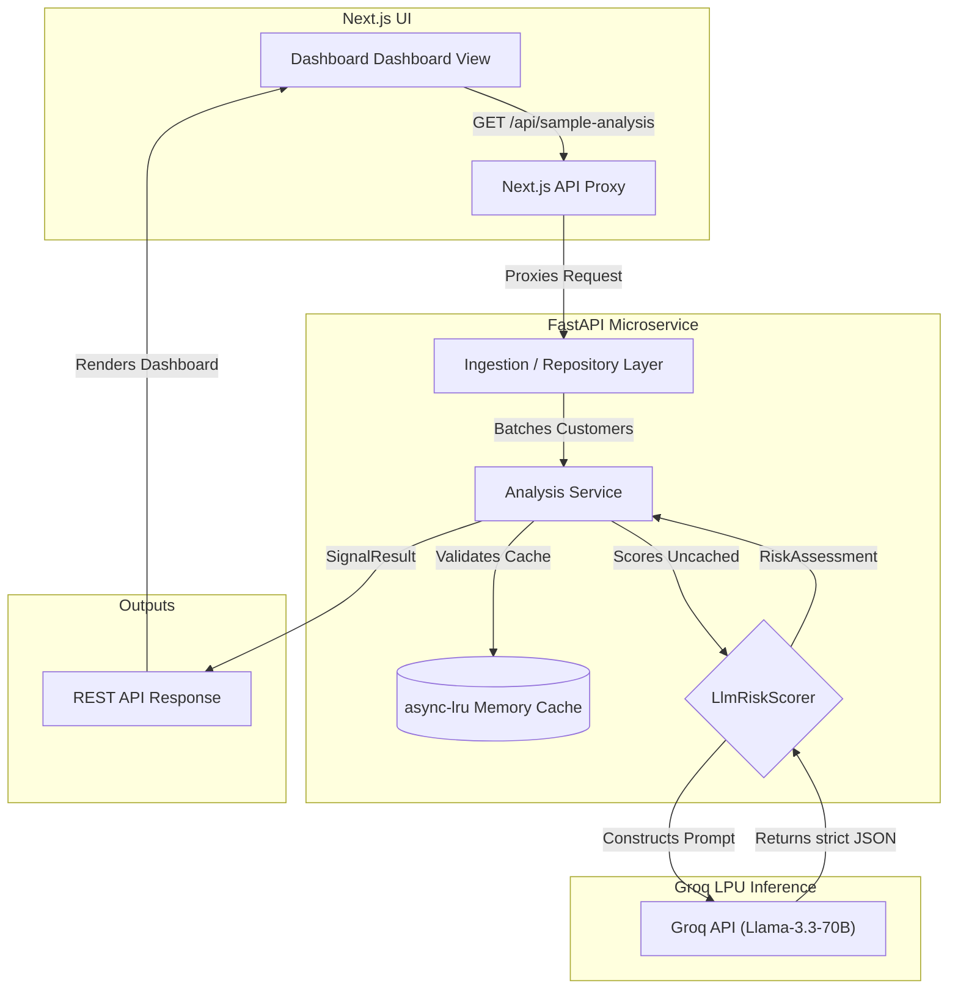
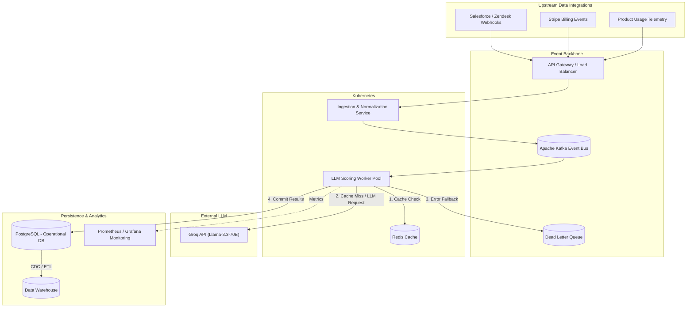

# Intelligent Customer Signal Detector

This repository contains a proof-of-concept AI prototype that proactively identifies at-risk customers by analyzing interaction data (support transcripts) alongside structured behavioral metrics (usage patterns, billing).

## The Approach
Traditional customer retention processes are reactive and siloed. This prototype acts as a **Unified Risk Engine**. It accepts a combination of structured customer data (plan value, recent support tickets, usage drops, payment failures) and unstructured data (a longitudinal array of chat transcripts). 

Instead of relying on rigid, rule-based thresholds, it feeds this holistic customer profile into a highly optimized Large Language Model prompt. The AI evaluates the customer's sentiment progression over time to infer a dynamic Customer Satisfaction (CSAT) score, calculates an overall churn risk score (0-100), and outputs a fact-grounded rationale with a recommended next step for the retention team.

## Architecture Design & Data Flow



### Data Flow Execution:
1. **Ingestion & Request:** The user hits the Next.js dashboard, triggering a call to the FastAPI backend. The repository layer dynamically loads the synthetic dataset (`PolyAI/banking77`) and structures it into chronologically sorted longitudinal multi-day arrays.
2. **Throttling & Batching:** The `AnalysisService` batches these customers and passes them through an `asyncio.Semaphore` to throttle concurrency, strictly respecting Groq's 8,000 Tokens Per Minute limits.
3. **Semantic Caching:** The LLM prompt is hashed; if a cached result exists in `async-lru`, it is instantly returned, saving API quotas and reducing latency to zero.
4. **Scoring:** For cache misses, `LlmRiskScorer` queries the Groq API. If a `429 Rate Limit` occurs, a `tenacity` exponential backoff triggers transparently.
5. **Presentation:** The LLM returns a strictly typed JSON payload containing the computed Risk Score, CSAT, rationale, and recommended actions, which is serialized through Pydantic back to the frontend.

## Future Enhancements & Production Architecture
While the current prototype uses a synchronous monolithic loop for fast feedback, the target production architecture would evolve into an event-driven, horizontally scalable microservice ecosystem capable of analyzing millions of signals per day.



### Production Enhancements:
- **Asynchronous Event Processing:** Replacing the synchronous REST batching with an Apache Kafka stream and background Kubernetes worker nodes to handle massive traffic spikes resiliently.
- **Agentic Actions:** Transitioning from merely suggesting a "Recommended Action" to directly calling functions (e.g., automatically drafting Zendesk emails or issuing Stripe refunds) via LLM tool-calling.
- **Model Fine-Tuning:** As the dataset of accurate scores grows, transitioning from prompting a versatile 70B model to a cost-effective, fine-tuned 8B local model.

## Tools Used
- **Backend Core:** Python 3.12 with FastAPI for a high-performance, asynchronous REST API.
- **Frontend Dashboard:** Next.js (React) and Tailwind CSS for the user interface.
- **AI / LLM Engine:** Groq API using the `Llama-3.3-70B-Versatile` model for high-speed, sub-second inference.
- **Data Sourcing:** Hugging Face Datasets (`PolyAI/banking77`) to synthesize realistic customer support tickets.
- **Resiliency:** `tenacity` for exponential backoff retries and `async-lru` for semantic LLM response caching.

## Assumptions Made
1. **Data Availability:** It is assumed that in a production environment, an ingestion pipeline (e.g., Kafka) would normalize events from disparate sources (Stripe, Zendesk, Mixpanel) into the unified `Customer` schema used by this prototype.
2. **Longitudinal Synthesis:** Because the chosen open-source dataset (`banking77`) contains isolated single utterances, the system artificially groups them and injects mock timestamps to successfully simulate multi-day longitudinal frustration.
3. **Graceful Degradation:** If the LLM rate limit is exceeded on the free tier, the system falls back to a heuristic rule-based scoring method (e.g., heavily weighting payment failures) rather than crashing the pipeline.

## Design Notes
- **Monolithic Deployment for a Microservice Architecture:** While the system is built as decoupled microservices (FastAPI backend + Next.js frontend), it is optimized for rapid prototype deployment. The Next.js frontend uses a `rewrites` configuration to proxy all `/api/*` requests directly to the FastAPI backend, bypassing CORS and allowing both services to run in a single Docker container seamlessly.
- **LLM Rate Limit Management:** Groq's free tier imposes a strict 8,000 Tokens Per Minute (TPM) limit. To prevent cascading failures when processing bulk customer data, the `AnalysisService` uses an `asyncio.Semaphore` to throttle concurrent LLM calls.
- **Resiliency & Exponential Backoff:** The `LlmRiskScorer` implements the `tenacity` library. If a `429 Rate Limit` or `Timeout` error occurs, the system transparently performs an exponential backoff retry before finally yielding to the fallback heuristics.
- **In-Memory Semantic Caching:** To further protect API limits and ensure a snappy user experience on dashboard refreshes, the `async-lru` library is used to memoize LLM JSON responses based on the exact prompt string.
- **Strict JSON Outputs:** The LLM is strictly constrained using Groq's `response_format={"type": "json_object"}` to guarantee deterministic deserialization of the risk signals.

## Setup Instructions

### Prerequisites
- **Python 3.12+**
- **Node.js 20+**
- **Groq API Key** (Create one for free at console.groq.com)

### Option 1: Docker / Koyeb Deployment (Recommended)
A monolithic `Dockerfile` and `start.sh` script are provided to build and deploy both services in a single container, perfect for platforms like Koyeb.
1. Add your Groq API Key to your platform's environment variables as `GROQ_API_KEY`.
2. Deploy directly to Koyeb by connecting your GitHub repository. The platform will automatically detect the `Dockerfile`.
3. To test the Docker build locally:
   ```bash
   docker build -t signal-detector .
   docker run -p 3000:3000 -e GROQ_API_KEY="your_api_key_here" signal-detector
   ```
4. Access the dashboard at `http://localhost:3000`.

### Option 2: Local Development

**1. Backend Setup (FastAPI)**
Navigate to the backend directory, set up a virtual environment, and start the Uvicorn server.
```bash
cd backend
python3 -m venv .venv
source .venv/bin/activate
pip install -r requirements.txt
cp .env.example .env
```
*Note: Open the `.env` file and insert your `GROQ_API_KEY`.*
```bash
# Start the backend server on port 8000
uvicorn app.main:app --reload
```

**2. Frontend Setup (Next.js)**
In a new terminal window, navigate to the frontend directory and start the Node development server.
```bash
cd frontend
npm install
npm run dev
```
3. Open `http://localhost:3000` in your browser. The Next.js config will automatically proxy API requests to your running backend.

## Example: Input and Output

**Sample Input Data (Customer Profile + Longitudinal Transcript)**
```json
{
  "customer_id": "HF-00003",
  "name": "Banking77 Account 3",
  "plan": "Enterprise",
  "monthly_value": 12800,
  "usage_change_pct": -42,
  "payment_failed": false,
  "transcripts": [
    {
      "date": "2026-08-15",
      "text": "The reporting workflow is incredibly slow today."
    },
    {
      "date": "2026-08-17",
      "text": "This is still not resolved. We are considering cancellation."
    }
  ]
}
```

**Sample Output Data (AI Analyzed Risk Assessment)**
```json
{
  "score": 85,
  "level": "Critical",
  "calculated_csat": 1.2,
  "signals": ["Reporting workflow issue", "Cancellation threat"],
  "reasons": [
    "Massive 42% drop in product usage.",
    "Explicitly stated intent to cancel due to unresolved performance issues."
  ],
  "rationale": "High-value enterprise customer is experiencing critical performance degradation and has explicitly threatened to churn.",
  "recommended_action": "Immediately escalate to the Enterprise Success Manager and schedule an emergency troubleshooting call."
}
```
