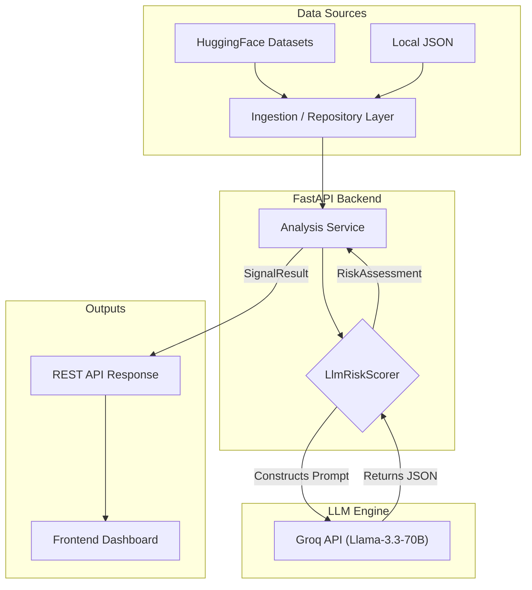
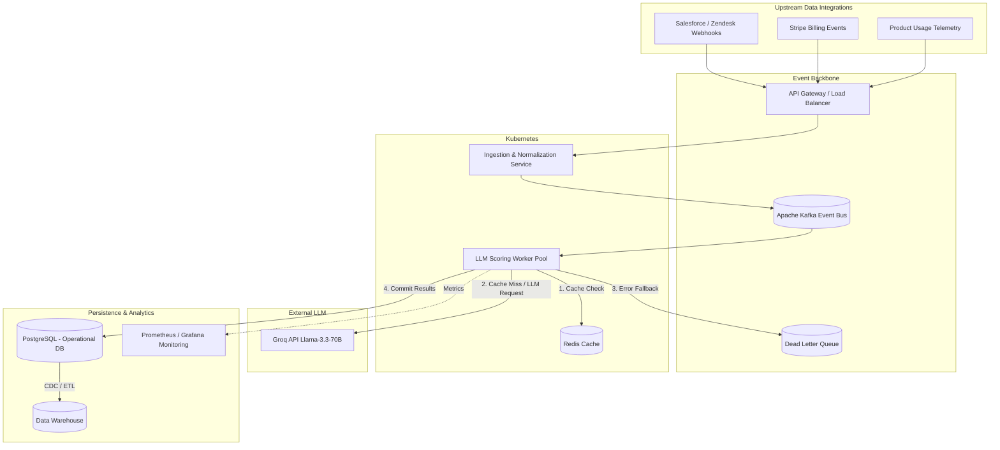

# Intelligent Customer Signal Detector

## 1 PROBLEM UNDERSTANDING AND OBJECTIVE

Customer retention teams face a critical challenge: data fragmentation. Signals of churn—such as billing failures, sharp declines in product usage, and increasingly frustrated support interactions—are siloed across different platforms (Stripe, Mixpanel, Zendesk, etc.). Traditional risk scoring systems use static, rule-based thresholds that fail to understand the nuance of human interaction and often trigger false positives or miss complex churn patterns.

**Objective:** Build a prototype for a unified risk engine that accepts disparate customer data inputs (structured metrics and unstructured chat transcripts), correlates them in real-time, and generates a prioritized list of at-risk customers. The system must leverage LLMs to dynamically assess customer sentiment over longitudinal interactions (multi-day chat histories) and provide an explainable AI rationale with actionable next steps for the retention team.

---

## 2 SOLUTION ARCHITECTURE AND DESIGN FLOW

The system is designed with a clear evolution path. Below is a side-by-side comparison of the **Current MVP Prototype** (a synchronous, monolithic fast-feedback loop) and the **Target Enterprise Architecture** (an event-driven, horizontally scalable microservices design).

### Current MVP Architecture (Prototype)



### Target Enterprise System Architecture (Production)



### Data Flow & Component Responsibilities (Target Architecture)
1. **Event Ingestion & Normalization:** The API Gateway receives disparate webhooks (e.g., a closed Zendesk ticket, a Stripe payment failure). The Ingestion Service normalizes these payloads into a unified `CustomerInteraction` schema and publishes them to an Apache Kafka topic.
2. **Asynchronous Scoring:** A horizontally scaled pool of Kubernetes worker nodes consumes the Kafka stream. This decoupling ensures the system can absorb massive traffic spikes without dropping requests.
3. **Semantic Caching & LLM Routing:** Before querying the LLM, workers check a Redis cache using hashed transcript timelines. On a cache miss, the worker queries the Groq LPU inference engine with an optimized zero-shot prompt.
4. **Resiliency & Observability:** If the LLM rate-limits or times out, the worker gracefully degrades to heuristic scoring or routes the event to a Dead Letter Queue (DLQ) for asynchronous retry. Prometheus scrapes latency metrics to trigger Kubernetes auto-scaling.
5. **Persistence & Data Lake:** Scored results are stored in PostgreSQL for operational frontend querying, while Change Data Capture (CDC) streams the data into Snowflake for executive churn dashboards and data science model training.

---

## 3 IMPLEMENTATION HIGHLIGHTS

### Dynamic CSAT and Longitudinal Transcript Analysis
Instead of relying on a pre-calculated satisfaction score, the application feeds a chronological array of messages to the LLM to infer the sentiment progression dynamically.

```python
# Formatting the longitudinal transcripts for the LLM
transcript_text = "\n".join([f"[{t.date}] {t.text}" for t in customer.transcripts])

prompt = f"""
Analyze this customer's longitudinal support interaction and structured data to determine churn risk and calculate their CSAT (Customer Satisfaction Score, 1-5).
Customer: {customer.name}
Usage Change: {customer.usage_change_pct}%
Transcripts:
{transcript_text}

Provide a JSON output strictly in the following format:
{{
  "score": <integer from 0 to 100 representing risk severity>,
  "calculated_csat": <float from 1 to 5 based on the sentiment progression>,
  ...
}}
"""
```

### Graceful Degradation (Fallback Logic)
To ensure system resilience in production environments subject to rate limits or API downtime, the scoring engine cascades gracefully back to a rule-based calculation if the LLM fails. The system explicitly captures HTTP errors to provide clear debugging paths for the frontend.

---

## 4 CHALLENGES AND LEARNINGS

**Challenge 1: Enforcing Strict JSON Outputs from LLMs**
*Issue:* LLMs often wrap JSON outputs in Markdown code blocks (e.g., ` ```json `), which breaks `json.loads()`.
*Solution:* Leveraged Groq's `response_format={"type": "json_object"}` API parameter and explicitly instructed the LLM in the system prompt to avoid markdown formatting, ensuring predictable, deserializable outputs every time.

**Challenge 2: Processing Multi-Day Transcripts**
*Issue:* Open-source datasets like `Banking77` only contain single utterances.
*Solution:* Wrote a custom data synthesis script (`huggingface_repository.py`) to group 1-3 utterances of similar intents and mock chronological timestamps. This allowed the LLM to accurately simulate and track a customer's escalating frustration over time.

**Key Learnings:**
- Relying on LLMs for quantitative metrics (like a 1-5 CSAT score) works remarkably well when provided with context (multi-day timelines) rather than isolated strings.
- Graceful API degradation and structured error handling are paramount when relying on 3rd-party LLMs for core backend logic.

---

## 5 DEMO SUMMARY AND NEXT STEPS

### Demo Summary
The MVP operates as a high-speed FastAPI microservice capable of reading customer metrics, dispatching them to Groq's Llama-3.3-70B model, and returning an enriched, explainable payload detailing exactly *why* a customer is at risk and what the retention team should do next.

### Next Steps & Production Enhancements
Given more time, the following enhancements would be prioritized for a production release:
1. **Asynchronous Event Processing:** Migrate from a synchronous REST endpoint to a queue-based architecture (e.g., Kafka/Celery) where customer state changes trigger background LLM evaluations asynchronously.
2. **Caching:** Implement Redis to cache LLM responses for customers whose transcripts or core metrics haven't changed since the last evaluation, reducing API costs and latency.
3. **Agentic Workflows:** Extend the "Recommended Action" output into an actionable system—allowing the LLM to autonomously draft apology emails, trigger automated refunds via Stripe, or directly escalate high-risk tickets to senior support tiers.
